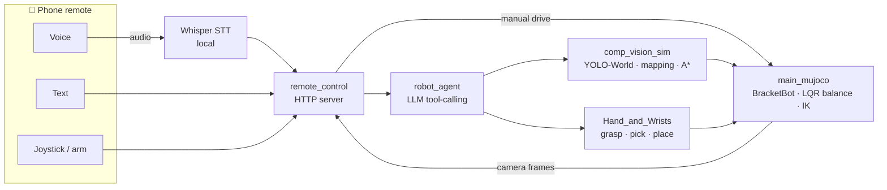

<div align="center">

# 🤖 Butler[bot]

**An affordable home robot that finds, picks up, and moves everyday objects,
and you drive it from your phone with a joystick, typed commands, or your voice.**

[](https://devpost.com/software/butler-bot)
[](https://github.com/EliteAtlantico/Butler-Bot-/actions/workflows/ci.yml)


*Built for **Battle of the Schools**. [Devpost](https://devpost.com/software/butler-bot).*

</div>

---

> *"Bring me the water bottle from the kitchen."*
>
> Butler[bot] works out what you asked for, searches the house, drives over,
> picks it up, and brings it back. You can take over from your phone at any point.

Industrial robots are expensive and built for factories. We wanted to know
which personal-robot abilities would matter most at home, and settled on the
chores nobody enjoys. Butler[bot] runs on
BracketBot, a two-wheeled self-balancing robot with two arms,
inside a full MuJoCo physics simulation. It combines open-vocabulary vision, an
LLM that plans with tool calls, and a phone remote, so manual control is always
available whatever the autonomy is doing.

##  Features

| | |
|---|---|
|  **Phone remote** | Virtual joystick, arm and gripper control, live camera feed (scene, head, and wrist views, with an RGB/depth toggle), and an **E-STOP**. |
|  **Voice and text commands** | *"Put the remote in the basket, then hand me the can."* Speech is transcribed **locally** with Whisper, and the robot answers out loud with Piper TTS. |
|  **LLM agent brain** | A local LLM carries out requests by calling tools (look around, go near, inspect, plan a grasp, pick up, put down) and reads each result before choosing the next step. There is no fixed list of chores. |
|  **Find anything by name** | Pretrained **YOLO-World** detects objects it was never trained on in this simulator ("a TV remote", "a floor lamp"), with a vision LLM as a fallback. |
|  **Search the house** | Occupancy mapping and A\* planning. When the target isn't in view, the LLM looks at an 8-photo 360° survey and picks where to search next. |
|  **Real grasping** | Friction grasps (no welds) from a self-balancing base. The planner chooses a top or side grasp, the arm, the wrist angle, and where to park, then checks it with IK. |
|  **Hands back control** | If a search gives up, the robot hands you the phone remote with the same robot in the same place. Moving the joystick at any time cancels the current task. |

## 📊 Results

Every number comes from a benchmark script in this repo. A trial counts as a
pass only if the robot reports success **and** the simulator confirms it
afterwards.

| Benchmark | Result |
|---|---|
| Pick an item from a random spot and rotation (`eval_pick.py`) | **83 / 84** |
| Full chores: put it in the basket, hand it to a person, tidy the table (`eval_tasks.py`) | **28 / 30** |
| Camera position estimate vs ground truth (`eval_vision.py`) | **2 to 5 mm** centre error |
| Furniture bumps during picks | **0 / 84** (told where items are), **1 / 84** (camera) |
| Balancing velocity tracking, 0.8 m/s command | **0.78 m/s**, under 2° of pitch |

Per-trial data is in [`Hand_and_Wrists/results/`](Hand_and_Wrists/results/).
CI re-runs the pick benchmark and checks that it matches the committed baseline
**bit for bit**.

##  How it works



The repo is split into four subsystems, plus glue code that joins them:

| Directory | What's in it |
|---|---|
| [`main_mujoco/`](main_mujoco/) | The robot model. We rebuilt a visual-only URDF into a working sim (floating base, driven wheels, collision, seven RGB-D cameras). It includes an **LQR balance controller** ported from the real robot, damped-least-squares arm IK, and base navigation. |
| [`comp_vision_sim/`](comp_vision_sim/) | Perception and navigation: YOLO-World detection, RGB-D to world coordinates, occupancy mapping, A\* planning, LLM scene reasoning and survey, local Whisper speech, and a random house generator for stress testing. |
| [`Hand_and_Wrists/`](Hand_and_Wrists/) | Manipulation: grasp enumeration and ranking, touch-sensing gripper, `Pick` and `Place` skills, surface discovery, and the chore controllers (`fetch`, `put`, `tidy`). |
| [`remote_control/`](remote_control/) | The phone app and its backend: MJPEG camera stream, joystick with a 350 ms server watchdog, text and voice tasks, E-STOP, and HTTPS through Tailscale for the iPhone microphone. |
| [`robot_agent/`](robot_agent/) | The LLM agent loop and the tools it can call. It works in any scene, with objects and furniture nobody hand-coded. |
| [`integration/`](integration/) | Glue between subsystems. The four subsystems never import from here, so each one still runs on its own. |

Each directory has its own README with the details.

##  Getting started

### Prerequisites

- **Python 3.12 or 3.13**
- **Windows only:** run `git config --global core.longpaths true` before
  cloning. Some mesh paths come close to the 260-character limit, so clone into
  a short path such as `C:\bb`.
- *Optional:* a local, OpenAI-compatible **llama-server** at
  `http://localhost:8080/v1` serving a tool-capable model (we used
  `Qwen/Qwen3.8-27B`, started with `--jinja`). Without it, the phone remote and
  scripted chores still work. Only the LLM features are unavailable.

### Install

```bash
git clone https://github.com/EliteAtlantico/Butler-Bot-.git
cd Butler-Bot-
python -m venv .venv
source .venv/bin/activate            # Windows: .venv\Scripts\activate

pip install -r requirements-test.txt       # sim, vision (YOLO-World), tests
pip install -r remote_control/requirements.txt   # phone remote + Whisper
```

> [!TIP]
> On a machine without a GPU, install CPU-only PyTorch first so `ultralytics`
> doesn't pull in CUDA:
> `pip install torch torchvision --index-url https://download.pytorch.org/whl/cpu`

### Run it

** The phone remote (the main demo)**

```bash
python -m remote_control.server
```

Open <http://127.0.0.1:8000>, or the LAN URL the server prints, on your phone.
Drive with the joystick, switch cameras, or hold **TALK** and try:

- *"Pick up the red cup"*
- *"Bring me the water bottle"*
- *"Tidy up the table"*

Add `--viewer` to watch the robot in 3D at the same time. Browsers only allow
the microphone over HTTPS, so for voice on a phone see
[Voice through Tailscale](remote_control/README.md#voice-on-a-phone-https-through-tailscale).

**Talk to the agent directly**

```bash
python -m robot_agent "put the remote in the basket, then hand me the can"
python -m robot_agent --scene apartment --viewer "move the ball on the floor onto a chair"
python -m robot_agent --voice          # speak your requests
python -m robot_agent --list-tools     # see what the LLM can do
```

** Search a house for something**

```bash
python comp_vision_sim/run_navigation.py --scene comp_vision_sim/home_search.xml \
    --command "find me a key"
```

** Chores without an LLM**

```bash
cd Hand_and_Wrists
python run_task.py fetch --item remote            # find the remote, hand it to the person
python run_task.py put --item remote --to basket
python run_task.py tidy                           # everything on the coffee table -> basket
```

** Just the balancing robot**

```bash
cd main_mujoco
python run.py --algorithm pick    # drive around an obstacle and pick a cube off a table
```

> [!NOTE]
> Rendering needs a GL backend, set with `MUJOCO_GL`: `wgl` for off-screen on
> Windows, `glfw` for the viewer, `egl` on headless Linux, and `osmesa` in a
> container with no GPU. The entry points pick a sensible default.

##  Testing

```bash
python -m pytest                              # the whole suite
python -m pytest -m "not integration"         # fast unit tests only
python ci/smoke_pipeline.py                   # end to end: give up -> phone remote, drive -> pick
```

CI (GitHub Actions) runs three jobs on every push:

- **lint**: `ruff`
- **test**: the full suite on Python 3.12 and 3.13, headless through EGL
- **integration-smoke**: the pipeline smoke test, plus the pick and chore
  benchmarks checked against their committed baselines

See [`TESTING.md`](TESTING.md) for coverage and the test markers.

## Challenges and what we learned

The hardest part was not any single component. It was **getting every part to
agree on what the robot was doing at any moment**, across navigation,
recognition, the arm, the LLM, and a person holding a joystick. Some lessons
from getting there:

- **Picking from a balancing robot is hard.** When the 1.2 kg arm reaches
  forward, the centre of mass shifts, and the balance controller responds by
  rolling the base. We feed the arm's lean forward into the balance loop,
  switch to stiffer gains while the arm works, and re-solve IK every tick.
  Holding position improved from 12 cm of drift to 2 mm.
- **The camera loses things as it gets close.** The head camera sits 1.54 m up
  and is tilted down 22°, so a short obstacle drops out of frame as the robot
  approaches. Navigation keeps a local map and only clears cells it can
  actually see through.
- **Don't let the LLM loop forever.** The agent refuses a third identical call
  that has already failed twice, and every tool returns *why* it failed, so the
  model can try something different.
- **Keep manual control available.** However good the autonomy gets, the phone
  can always take over.

##  What's next

- Understanding vaguer requests, and longer multi-step tasks
- Better detection of small items (keys were too small for the head camera at pick range)
- Moving from simulation to the real BracketBot hardware


<div align="center">

**https://devpost.com/software/butler-bot)**

</div>
